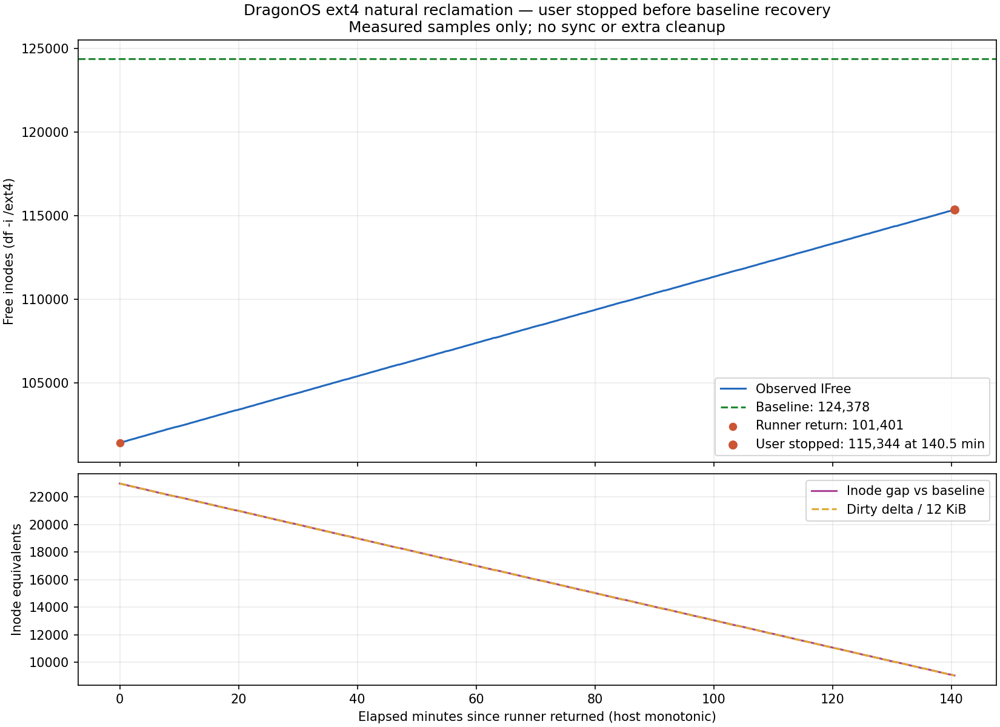

# ext4_create_delete_files_10k_ops 后台自然回收时间曲线

[返回 Issue](../../index.md) · [材料目录](../../README.md)

## 目的与环境

在不执行显式同步或额外清理的情况下，延长单轮负载后的静置时间，记录空闲 inode 数与时间的关系，检查自然回收是否持续推进、速度是否变化或出现平台。

原记录为 `attempt-natural-idle-20261003T153307Z`，开始时间为 2026-10-03 23:33:07（北京时间）。源码为 `3ffc8327522dbd650505015202dce35fee545ef8`，分支为 `experiment/lmbench-ext4-pressure-20261003`。新启动的 guest 复用前两组实验的内核和独立基础镜像：x86_64、KVM、2 vCPU、2 GiB RAM、`snapshot=on`；`/ext4` 仍是根 ext4 上的普通目录，`/tmp` 为 tmpfs。

## 方法

先采集运行前基线，原样运行一次：

```sh
cd /opt/tests/benchmark/lmbench
sh run.sh --only ext4_create_delete_files_10k_ops \
  --samples 1 --timeout 120 --warmup 0
```

以 runner 返回作为时间轴 `t=0`，此后每 15 秒通过串口读取一次 `/proc/meminfo` 和 `df -i /ext4`。样本明确分段，CSV 在宿主机及时写入；不在 guest 磁盘上写采样文件。时间使用宿主 monotonic，每个时点的内存统计与 inode 统计仍是先后读取，不是原子快照。

全程不执行 `sync`、`drop_caches`、`umount` 或额外清理，也不继续运行 benchmark。原计划等待 IFree 接近运行前基线并稳定至少两分钟，保护上限为静置六小时。用户在已有数据足够绘图时要求停止；最终图和统计只覆盖已观测时段，没有外推为实际恢复结果。

## 结果

原生 runner 返回 `rc=0`，输出 2831 ops/sec，调用耗时 57.610 秒。之后取得 **563 个样本，覆盖 140.5 分钟**，未发生 panic。

| 指标 | 数值 |
| --- | ---: |
| 运行前 IFree | 124378 |
| runner 返回时 IFree | 101401 |
| 最后样本 IFree | 115344 |
| 已归还 inode | 13943 |
| 剩余 inode 缺口 | 9034 |
| 平均自然回收速度 | 1.653974 个/秒，约 99.24 个/分钟 |
| 线性拟合斜率 | 1.654528 个/秒 |
| 线性拟合 R² | 0.9999972107 |
| 实际采样间隔 | 14.985487–15.014297 秒 |
| 最长单次采样耗时 | 0.050116 秒 |



上图第一部分显示 `IFree` 和运行前基线，第二部分比较 inode 缺口与 `Dirty` 增量除以 12 KiB；完整矢量版见 [inode-curve.svg](inode-curve.svg)。

部分阶段如下，内存单位为 KiB，完整数据见 [inode-curve.csv](inode-curve.csv)：

| 阶段 | 时间（分钟） | IFree | Dirty | Cached | Slab | MemFree |
| --- | ---: | ---: | ---: | ---: | ---: | ---: |
| 运行前基线 | — | 124378 | 28 | 2928 | 14620 | 2045876 |
| runner 返回 | 0.00 | 101401 | 275752 | 281072 | 398236 | 1383820 |
| 自然静置一小时 | 60.00 | 107377 | 204000 | 209360 | 340196 | 1513496 |
| 自然静置两小时 | 120.00 | 113320 | 132684 | 138044 | 277984 | 1646912 |
| 最后样本 | 140.50 | 115344 | 108396 | 113756 | 255108 | 1694048 |

运行结束时，IFree 缺口为 22977，Dirty 增量为 275724 KiB，满足 `22977 × 12 KiB`。后续各样本的 `Dirty 增量 − inode 缺口 × 12 KiB` 在 **−136 到 0 KiB** 之间；最后为 −40 KiB。不能将整段实验描述为每个样本都严格相等，也不能仅凭这类少量差异认定具体原因。

最后样本仍有 9034 个 inode 未恢复，Dirty 仍为 108396 KiB。`summary.json` 标记为 `user_stopped`，`natural_recovery_complete=false`；本次没有观察到自然回收完成后的稳定平台。

## 源码链路与吞吐线索

源码中存在与实测速率相近的固定后台派发限制：

- 当空闲物理页不少于 4096 页时，`page_reclaim` 执行一次后台脏页写回，然后休眠 5 秒，见 [page.rs 的线程循环](../../../../../../../../../kernel/src/mm/page.rs#L601)。
- `flush_dirty_pages_snapshot()` 每轮最多成功启动 8 个 PageCache runner；`scheduled_runners` 在本轮只增加，不随任务完成而减少，见 [派发预算](../../../../../../../../../kernel/src/mm/page.rs#L963)。
- 每个 runner 处理一个 PageCache 内的有界范围，最多覆盖 512 页。ext4 inode 各自拥有 PageCache，而 10 KiB 小文件只有三个数据页，仍消耗一个 runner 名额。

因此，这条后台路径在大量小文件负载下的数量级为 `8 / 5 ≈ 1.6 个文件/秒`，与实测 1.65 接近。这是源码和观测相符的瓶颈线索，尚未通过每轮派发计数或预算变更对照确认它是本次现场的唯一或主要限制。

最后一次 unlink 返回回收句柄后，`pending_reclaim` 保存待回收状态；仍有打开文件、缓存、异步工作或操作等语义持有时，最终 eviction 不会开始。脏 inode 队列持有 `Arc` 和 `AsyncWork`，持有归零后由 `on_zero_retention()` 尝试入队 `ext4_evict`，后者排空延迟分配、截断 PageCache 并回收磁盘 inode。对应源码入口为：

- [脏 inode 入队与释放](../../../../../../../../../kernel/src/filesystem/ext4/filesystem.rs#L998)。
- [待回收句柄及调度门槛](../../../../../../../../../kernel/src/filesystem/ext4/inode.rs#L5246)。
- [最终 eviction](../../../../../../../../../kernel/src/filesystem/ext4/inode.rs#L5294)。

另有 [vfs_writeback 元数据线程](../../../../../../../../../kernel/src/filesystem/vfs/writeback.rs#L29)，会周期性调用文件系统同步路径；它还可能推动延迟数据排空。`ext4_evict` 的 workqueue 本身没有逐 inode 的五秒休眠。具体耗时发生在待写回、等待持有归零还是已入队的最终回收阶段，仍需运行时区分。

## 观察与边界

观测区间内自然回收持续且几乎线性，没有长期平台，也没有明显加速。这支持资源积压能够持续释放、但后台吞吐很低的判断；不能据此声称已经排空所有资源或排除局部泄漏。Slab 仍是分配器持有物理页统计，不等于活对象字节数。

本次没有延长 sample 超时，没有手动同步推动后半程，也没有改变内核、文件大小或校准参数。线性拟合用于描述已有数据，不作为未采集时段的结果。先前[短时静置与 sync 对照](../sync-reclaim-experiment/report.md)来自另一台全新 guest，其结果不混入本曲线。

## 附件与完整性

- [全部样本 CSV](inode-curve.csv)、[PNG](inode-curve.png)、[SVG](inode-curve.svg)、[统计与拟合](analysis.json)。
- [完整原始串口](serial.log)、[可读串口](serial-readable.txt)、[实验身份](manifest.json)、[结果及停止原因](summary.json)、[退出与采样验证](validation.json)。

全部 563 个样本标记完整，时间间隔连续；原生 runner 执行一次，`sync` 执行零次。控制器和本次 QEMU 已退出，基础磁盘及内核 SHA256 前后不变。该报告只归档有效 attempt；更早因宿主采集器解析问题而中止的启动尝试没有并入本数据集。
